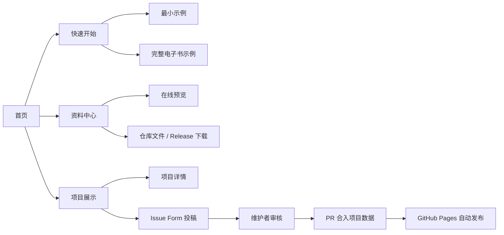
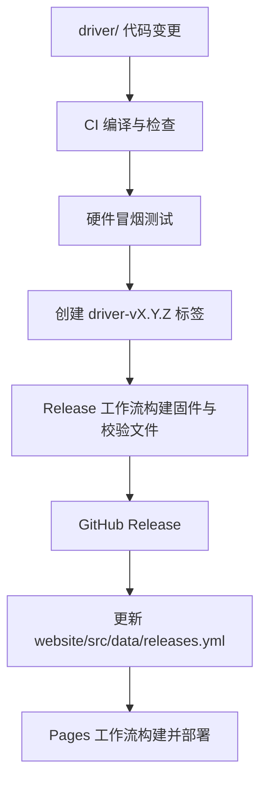

# OpenEPD 4.7 开源门户设计说明

**日期：** 2026-07-29

**状态：** 已确认设计，待实施

**目标仓库：** `exomind-team/openepd-47`

**参考体验：** 乐鑫 ESP32-S3-1 开源网站

**设计方向：** A — 平衡型（资料、驱动、社区项目同等重要）

## 1. 项目定位

OpenEPD 4.7 是面向 4.7 英寸、684×1216 黑白电子纸模组的开源入口。它把目前分散在资料包、示例工程、上游仓库和外部网页中的内容，整理为一个可追踪、可下载、可持续更新的 GitHub 仓库和 GitHub Pages 网站。

首期服务三类用户：

1. 第一次拿到屏幕，希望快速点亮的开发者。
2. 需要查阅原理图、结构图、屏幕规格和接口定义的硬件开发者。
3. 希望展示基于该屏幕或兼容屏幕项目的社区贡献者。

成功标准：

- 新用户能从首页在三次点击内到达“快速开始”“资料下载”或“项目展示”。
- 仓库内存在可复现构建的最小点屏示例，以及来源明确的完整示例。
- 公开资料均能回答“来自哪里、能否再分发、对应哪个硬件版本”。
- 社区无需网站账号或自建后端，即可通过 GitHub Issue/PR 投稿。
- `main` 分支通过检查后自动部署 GitHub Pages；驱动标签发布可生成 GitHub Release。

## 2. 范围与非目标

### 2.1 MVP 范围

- 中文优先的静态文档门户。
- 产品概览、快速开始、硬件资料、驱动文档、下载中心、常见问题。
- ESP-IDF 驱动集成层、最小示例、整理后的原始电子书示例。
- GT911 触摸接入说明和官方依赖。
- 社区项目展示与 GitHub Issue Forms 投稿入口。
- GitHub Pages、持续集成、Release 产物和来源清单。

### 2.2 暂不包含

- 网站账号、在线固件烧录、上传服务或数据库。
- 社区项目自动审核和自动发布。
- Arduino、MicroPython、Zephyr 等多框架驱动。
- 英文全文翻译；结构预留国际化能力，MVP 先完成中文。
- 电子纸在线模拟器或云端编译。
- 对未拿到再分发许可的第三方 PDF 进行镜像。

## 3. 已核实的硬件与资料事实

本地资料源：`D:\downloads\4.7inch墨水屏资料-英瑞达`

- 屏幕规格：E0470A01-AF-S，4.7 英寸，684×1216，黑白电子纸。
- 触摸控制器：**GT911**；触摸结构图标注 6 针 FPC：VDD、GND、SDA、SCL、RST、INT。
- 电源管理相关资料：TPS65185。
- 现有 ESP-IDF 示例使用 I²C GPIO39/40，并包含 PCA9555、TPS65185、EPDiy 及电子书示例代码。
- 本地示例当前没有 GT911 驱动实现。
- 本地 `epdiy-upstream` 对应 `vroland/epdiy`，当前核实提交为 `8781397a…`，许可证为 LGPL-3.0。
- `FT5446U-DataSheet.pdf` 与实际触摸控制器不符，并带有保密标识，不纳入公开仓库。
- 原资料目录包含 `.cache`、`.git`、备份文件、重复压缩包、构建配置副本，以及演示 Wi‑Fi 凭据，不能原样上传。

GT911 的首选实现不是复制未知来源代码，而是使用乐鑫官方组件：

- 组件：`espressif/esp_lcd_touch_gt911`
- 许可证：Apache-2.0
- 组件页：<https://components.espressif.com/components/espressif/esp_lcd_touch_gt911>
- 源码：<https://github.com/espressif/esp-bsp/tree/master/components/lcd_touch/esp_lcd_touch_gt911>
- 公开数据手册来源：<https://www.fortec-integrated.de/fileadmin/pdf/produkte/Touchcontroller/DDGroup/GT911_Datasheet.pdf>

公开数据手册只在网站中登记来源并链接外部文件；除非执行阶段确认其再分发许可，否则不复制进仓库。

## 4. 信息架构与用户路径

### 4.1 顶级导航

- 首页
- 快速开始
- 开发文档
- 硬件资料
- 下载中心
- 项目展示
- 参与贡献

首页采用已经确认的平衡型结构：

1. 首屏说明产品、兼容对象与两个主要行动按钮。
2. “开始开发 / 浏览资料 / 查看项目”三入口。
3. 核心硬件规格卡片。
4. 驱动与资料最近更新。
5. 精选社区项目。
6. 贡献入口、许可证和来源说明。

### 4.2 核心路径



## 5. 仓库结构

坚持“驱动与网站在同一仓库的两个文件夹”：

```text
openepd-47/
├─ driver/                         # 驱动、板级适配与示例
│  ├─ components/openepd47/
│  ├─ examples/hello_epaper/
│  ├─ examples/ebook/
│  ├─ tests/
│  └─ README.md
├─ website/                        # Astro + Starlight 网站
│  ├─ public/resources/
│  ├─ src/content/docs/
│  ├─ src/content/projects/
│  ├─ src/data/
│  └─ README.md
├─ LICENSES/                       # 第三方许可证与来源声明
├─ .github/                        # CI、Pages、Issue Forms、PR 模板
├─ README.md
├─ CONTRIBUTING.md
├─ SECURITY.md
└─ LICENSE                         # 项目原创代码 Apache-2.0
```

不把体积较大的固件构建产物提交到 Git 历史；它们随版本标签发布到 GitHub Releases。获准公开的 PDF、图纸和小型资料优先放在 `website/public/resources/vendor/`，以便站内浏览和下载。

## 6. 驱动架构

`driver/components/openepd47` 是项目原创的板级集成层，负责：

- 板卡引脚、I²C 总线和硬件版本定义。
- TPS65185 电源时序与状态检查。
- PCA9555 扩展 IO 适配。
- EPDiy 显示面板初始化和刷新策略。
- GT911 的复位、INT 地址选择、坐标读取、方向转换和边界校验。
- 对示例暴露稳定、最小的 C API。

GT911 通过 ESP-IDF Component Registry 锁定版本，不复制其源码。EPDiy 若必须随仓库修改，则作为保留完整许可证和上游提交信息的 vendored component（随仓库第三方组件）管理，原创集成层不得把 LGPL 代码改写成 Apache-2.0。

示例分为：

- `hello_epaper`：最小可构建、可点亮、可显示测试图案的基线。
- `ebook`：从现有资料中清理得到的完整示例；移除凭据、缓存、备份和机器相关配置。

硬件自动化测试能力有限，因此 CI 负责“编译、静态检查、秘密扫描”；真实屏幕的显示、触摸和休眠由版本发布前的硬件冒烟清单覆盖。

## 7. 网站架构

技术栈：Astro、Starlight、TypeScript、少量自定义 CSS/组件。

选择原因：

- Starlight 原生提供文档侧栏、站内搜索、目录、代码高亮、SEO、深色模式与国际化基础。
- Astro 允许首页做成与参考网站相近的产品门户，而文档区保持稳定。
- 构建结果为纯静态文件，适配 GitHub Pages，不需要自建服务。

内容模型：

- `src/content/docs/`：教程、硬件和驱动文档。
- `src/content/projects/`：每个社区项目一份 Markdown/MDX。
- `src/data/resources.yml`：资料下载、来源、许可与校验值。
- `src/data/releases.yml`：网站展示的稳定版本和 Release 链接。

资源记录至少包含：

```yaml
id: display-e0470a01-af-s
title: E0470A01-AF-S 显示屏规格书
category: display
hardwareRevision: E0470A01-AF-S
sourceType: vendor-authorized
sourceUrl: ""
redistribution: authorized
localPath: /resources/vendor/E0470A01-AF-S.pdf
sha256: "导入脚本计算的 64 位小写十六进制值"
notes: 由资料提供方确认可公开
```

执行时必须用 Schema 校验内容；缺少来源、授权状态或本地文件的记录不能构建通过。

## 8. 社区展示流程

MVP 不建立账户系统。投稿者点击“提交项目”后进入 GitHub Issue Form，填写：

- 项目名称与一句话说明。
- 仓库/主页地址。
- 使用的屏幕、主控和软件框架。
- 封面图片和许可证。
- 与 OpenEPD 4.7 的兼容说明。

维护者审核链接、许可证和图片权利后，以 PR 新增 `website/src/content/projects/<slug>.mdx`。合并后触发站点构建并自动出现。后续投稿量足够大时，再考虑机器人把 Issue 转为草稿 PR。

## 9. 发布与更新流



- Pull Request：检查网站、驱动编译、链接、内容 Schema、许可证和秘密。
- `main`：部署 GitHub Pages。
- `driver-v*` 标签：构建固件，发布二进制、源码包、SHA-256 校验文件和变更说明。
- 依赖更新由 Dependabot/Renovate 类工具按月提交，禁止自动合并硬件依赖。

## 10. 资料与许可证治理

原创代码默认 Apache-2.0；第三方代码保持原许可证。每个资料文件必须进入以下类别之一：

1. `vendor-authorized`：资料提供方已允许公开，可镜像到仓库。
2. `upstream-licensed`：上游许可证允许再分发，可镜像并附许可证。
3. `external-link`：只有公开来源，未确认再分发许可，仅保存链接和元数据。
4. `excluded`：错误型号、保密、重复、含凭据或无明确来源，不进入公开仓库。

导入前生成 SHA-256 清单和来源台账。书面授权中的私人信息不直接公开，只在公开声明中写明授权范围和联系维护方式。

首批处理规则：

- 保留：厂商确认可公开的显示屏规格、结构图、TPS65185 资料、必要硬件图纸。
- 外链：GT911 数据手册。
- 依赖：乐鑫 GT911 官方组件、EPDiy 上游。
- 排除：FT5446U、重复 ZIP、`.cache`、`.git`、备份文件、构建产物、演示凭据。

## 11. 测试与质量门槛

网站：

- TypeScript/Astro 类型检查。
- 内容 Schema 与资源文件存在性检查。
- 生产构建。
- 内部链接和外部来源链接检查。
- Playwright 覆盖首页、文档搜索、资料下载、项目投稿入口及移动端。
- Lighthouse/axe 基础无障碍检查。

驱动：

- ESP-IDF v5.5.4 编译 `hello_epaper` 和 `ebook`。
- clang-format、组件依赖锁定、秘密扫描。
- 可在宿主机运行的纯函数单元测试：坐标转换、边界处理、触摸点解析。
- 发布前人工硬件冒烟：冷启动、全刷、局刷、五点触摸、旋转、休眠唤醒。

## 12. 风险与约束

- **硬件资料不一致：** 结构图中的 GT911 通道数量与公开数据手册可能有差异。网站只陈述实测或资料明确的事实，驱动以控制器返回值和板级测试为准。
- **许可证混合：** EPDiy 的 LGPL-3.0 与原创 Apache-2.0 分目录声明，构建产物保留必要告知。
- **GitHub Pages 限制：** 大型二进制放 Release，不把仓库变成固件镜像站。
- **无硬件 CI：** 编译通过不代表真实屏幕通过；Release 必须附硬件冒烟记录。
- **供应商资料版本：** 文件名、硬件版本、SHA-256 和来源必须同时登记，避免后续覆盖旧资料。

## 13. 分阶段交付

1. **来源审计与仓库基线：** 建立清单、许可证、排除列表、CI 骨架。
2. **最小驱动基线：** 点屏、GT911、最小示例、构建检查。
3. **网站 MVP：** 首页、文档、资源中心、GitHub Pages。
4. **社区与发布：** 项目展示、Issue Form、Release 工作流。
5. **公开首发：** 硬件冒烟、链接审计、首个标签和 Pages 发布。

本设计只定义执行边界和技术决策；不包含本轮实施。
