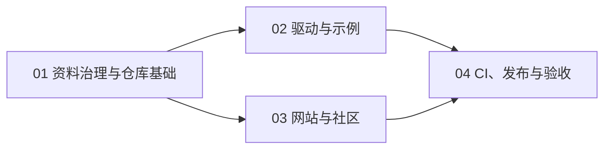

# OpenEPD 4.7 总实施路线图

> **For agentic workers:** REQUIRED SUB-SKILL: Use superpowers:subagent-driven-development (recommended) or superpowers:executing-plans to implement this plan task-by-task. Steps use checkbox (`- [ ]`) syntax for tracking.

**Goal:** 在 `exomind-team/openepd-47` 建立一个由 `driver/` 与 `website/` 组成的可维护开源仓库，发布可复现的 ESP-IDF 驱动示例、来源明确的 4.7 英寸电子纸资料，以及通过 GitHub Pages 展示的中文文档与社区项目门户。

**Architecture:** 单仓库管理驱动和网站；资料先审计再导入；驱动使用原创板级适配层组合 EPDiy、TPS65185、PCA9555 与乐鑫官方 GT911 组件；网站使用 Astro + Starlight；GitHub Actions 执行验证、Pages 部署和标签 Release。

**Tech Stack:** ESP-IDF 5.5.4、C/CMake、EPDiy、`espressif/esp_lcd_touch_gt911`、Astro、Starlight、TypeScript、Bun、Vitest、Playwright、GitHub Actions、GitHub Pages、GitHub Releases。

---

## 执行边界

- 本地目标：`D:\project\openepd-47`
- 远程目标：`https://github.com/exomind-team/openepd-47`
- 只读资料源：`D:\downloads\4.7inch墨水屏资料-英瑞达`
- 原始资料必须从允许清单逐项导入，禁止整目录复制。
- 每一任务完成验证后独立提交；失败时停在当前任务。
- 创建公开仓库、推送、启用 Pages、打标签和发布 Release 都是外部动作，执行时必须再次取得用户确认。

## 子计划与顺序

1. [资料治理与仓库基础计划](./2026-07-29-openepd-47-foundation-plan.md)
   - 建立来源清单、导入白名单、排除规则和许可证边界。
   - 创建仓库治理文件和固定目录结构。
2. [驱动与示例计划](./2026-07-29-openepd-47-driver-plan.md)
   - 建立最小 ESP-IDF 组件。
   - 接入 EPDiy、TPS65185、PCA9555 和 GT911。
   - 清理并迁移电子书示例。
3. [网站与社区计划](./2026-07-29-openepd-47-website-plan.md)
   - 实现平衡型首页、文档、资料中心和项目展示。
   - 通过 GitHub Issue Forms/PR 接受投稿。
4. [CI、发布与验收计划](./2026-07-29-openepd-47-release-plan.md)
   - 建立网站与驱动检查、Pages 和 Release 工作流。
   - 完成真实硬件冒烟和首发前审计。

## 阶段出口条件

| 阶段 | 必须满足 |
|---|---|
| 资料治理 | FT5446U、秘密、缓存、备份和重复包不在允许清单；每个公开资料有来源与授权状态 |
| 驱动 | 两个示例可在 ESP-IDF 5.5.4 干净构建；GT911 来源正确；坐标变换有测试 |
| 网站 | Astro 检查、构建、链接检查和 Playwright 通过；首页三入口可达 |
| 发布 | Actions 静态检查通过；真实硬件记录完成；待发布 Git 状态干净 |

## 最终完成定义

- `driver/examples/hello_epaper` 与 `driver/examples/ebook` 可复现构建。
- GT911 使用 `espressif/esp_lcd_touch_gt911`，不存在 FT5446U 驱动或错误说明。
- 网站可静态构建，文档、下载和项目展示路径通过端到端测试。
- 获准公开的厂商资料存入仓库；未确认再分发的第三方资料只登记来源链接。
- Git 历史中没有缓存、嵌套 Git、备份、重复 ZIP 和真实凭据。
- 首次公开发布仍需用户单独批准。

本路线图和四份子计划仅描述实施步骤，不代表工作已经执行。
